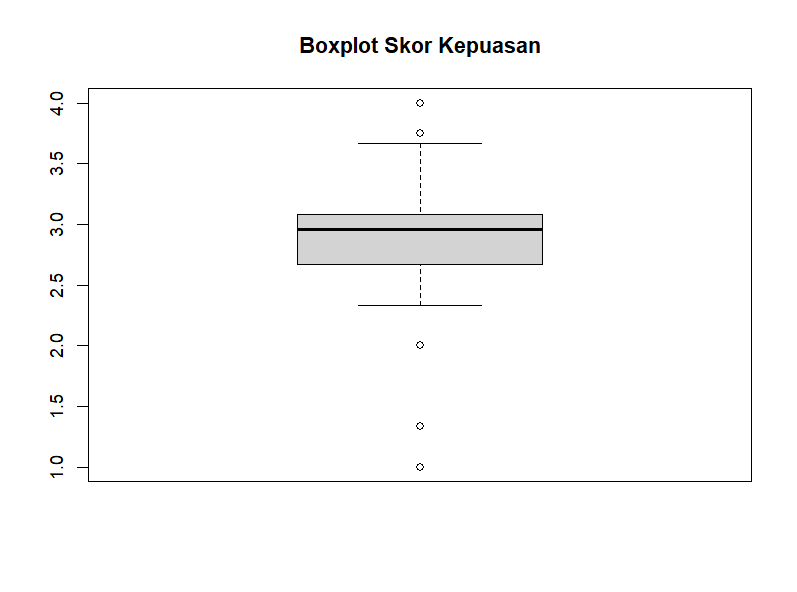

# ESTIMASI TINGKAT KEPUASAN MAHASISWA PROGRAM STUDI STATISTIKA UNIVERSITAS MATARAM TERHADAP KONEKSI INTERNET DI LINGKUNGAN KAMPUS MENGGUNAKAN TWO-STAGE CLUSTER SAMPLING

## Deskripsi Proyek

Proyek ini bertujuan untuk mengestimasi tingkat kepuasan mahasiswa Program Studi Statistika Universitas Mataram terhadap kualitas koneksi internet di lingkungan kampus. Penelitian dilakukan menggunakan pendekatan survei dengan instrumen kuesioner skala Likert 1–4 yang terdiri atas 12 indikator kepuasan.

Analisis dilakukan menggunakan dua metode sampling, yaitu Simple Random Sampling (SRS) dan Two-Stage Cluster Sampling. Kedua metode dibandingkan berdasarkan nilai estimasi rata-rata, standard error, relative standard error (RSE), interval kepercayaan, serta design effect untuk menentukan metode yang lebih efisien dalam mengestimasi tingkat kepuasan mahasiswa pada populasi.

Bahasa pemrograman yang digunakan adalah R dengan bantuan beberapa package statistik seperti readxl, dplyr, dan psych.

---
# DAFTAR ISI

- [Deskripsi Proyek](#deskripsi-proyek)
- [Latar Belakang](#latar-belakang)
- [Tujuan Penelitian](#tujuan-penelitian)
- [Metodologi Penelitian](#metodologi-penelitian)
- [Langkah-Langkah Analisis Menggunakan R Studio](#langkah-langkah-analisis-menggunakan-r-studio)
- [Hasil dan Pembahasan](#hasil-dan-pembahasan)
- [Kesimpulan](#kesimpulan)

---
# LATAR BELAKANG

Perkembangan teknologi informasi dan komunikasi telah memberikan perubahan yang sangat besar dalam dunia pendidikan tinggi. Internet tidak lagi hanya berfungsi sebagai sarana komunikasi, tetapi telah menjadi kebutuhan utama dalam mendukung berbagai aktivitas akademik mahasiswa. Berbagai kegiatan pembelajaran saat ini sangat bergantung pada ketersediaan akses internet yang memadai, mulai dari mengakses materi perkuliahan, mencari referensi ilmiah, mengikuti perkuliahan daring, mengunggah tugas, hingga mengakses berbagai sistem informasi akademik yang disediakan oleh universitas. Menurut Al-Fraihat et al. (2020), kualitas layanan teknologi informasi memiliki pengaruh yang signifikan terhadap kepuasan pengguna dalam lingkungan pendidikan. Semakin baik kualitas layanan yang diberikan, maka semakin tinggi pula tingkat kepuasan yang dirasakan oleh pengguna. Oleh karena itu, kualitas koneksi internet menjadi salah satu faktor penting yang dapat memengaruhi efektivitas proses pembelajaran mahasiswa.

Universitas Mataram telah menyediakan fasilitas jaringan internet yang dapat dimanfaatkan oleh mahasiswa dalam menunjang berbagai aktivitas akademik. Namun demikian, kualitas layanan internet yang dirasakan oleh mahasiswa dapat berbeda-beda tergantung pada pengalaman penggunaan masing-masing individu. Kondisi tersebut menyebabkan perlunya evaluasi secara berkala terhadap kualitas layanan internet yang tersedia di lingkungan kampus. Salah satu cara yang dapat digunakan untuk mengevaluasi kualitas layanan internet adalah dengan mengukur tingkat kepuasan mahasiswa sebagai pengguna utama layanan tersebut. Menurut Kotler dan Keller (2016), kepuasan merupakan perasaan senang atau kecewa seseorang yang muncul setelah membandingkan kinerja yang dirasakan dengan harapan yang dimiliki sebelumnya. Dalam konteks penelitian ini, kepuasan mahasiswa digunakan sebagai indikator untuk menilai sejauh mana kualitas koneksi internet kampus mampu memenuhi kebutuhan akademik mereka.

Pengumpulan data terhadap seluruh populasi mahasiswa memerlukan biaya, waktu, dan tenaga yang cukup besar. Oleh karena itu digunakan metode sampling sebagai alternatif yang lebih efisien untuk memperoleh informasi mengenai karakteristik populasi. Salah satu metode sampling probabilitas yang sering digunakan dalam survei adalah Two-Stage Cluster Sampling. Cluster sampling merupakan teknik sampling yang dilakukan dengan membagi populasi ke dalam kelompok-kelompok tertentu yang disebut cluster, kemudian memilih beberapa cluster secara acak sebagai sampel. Pada Two-Stage Cluster Sampling, setelah cluster terpilih dilakukan pemilihan unit sampel dari setiap cluster tersebut. Metode ini sangat sesuai digunakan pada populasi yang memiliki struktur kelompok yang jelas, seperti mahasiswa yang tergabung dalam kelas-kelas perkuliahan.
Dalam penelitian ini, kelas mahasiswa digunakan sebagai cluster pada tahap pertama dan mahasiswa digunakan sebagai unit sampel pada tahap kedua. Melalui pendekatan tersebut diharapkan diperoleh estimasi tingkat kepuasan mahasiswa yang representatif terhadap populasi mahasiswa Program Studi Statistika Universitas Mataram.

---

# TUJUAN PENELITIAN

1. Mengestimasi tingkat kepuasan mahasiswa Program Studi Statistika Universitas Mataram terhadap kualitas koneksi internet di lingkungan kampus.

2. Menerapkan metode Two-Stage Cluster Sampling dalam proses pengambilan sampel.

3. Mengevaluasi kualitas hasil estimasi menggunakan Standard Error (SE), Relative Standard Error (RSE), Interval Kepercayaan 95%, dan Design Effect (Deff).

---

# METODOLOGI PENELITIAN

## Sumber Data

Data yang digunakan dalam penelitian ini merupakan data primer yang diperoleh secara langsung dari responden melalui penyebaran kuesioner online menggunakan Google Form. Kuesioner disebarkan kepada mahasiswa Program Studi Statistika Universitas Mataram untuk memperoleh informasi mengenai tingkat kepuasan mereka terhadap kualitas koneksi internet yang tersedia di lingkungan kampus.

Data primer dipilih karena mampu memberikan informasi yang lebih spesifik dan sesuai dengan tujuan penelitian. Selain itu, penggunaan kuesioner memungkinkan peneliti memperoleh data secara langsung dari mahasiswa sebagai pengguna utama layanan internet kampus sehingga hasil yang diperoleh dapat menggambarkan kondisi yang sebenarnya di lapangan.

Seluruh data yang terkumpul kemudian diolah dan dianalisis menggunakan perangkat lunak R Studio untuk menghasilkan estimasi tingkat kepuasan mahasiswa terhadap layanan internet kampus.

## Populasi

Populasi dalam penelitian ini adalah seluruh mahasiswa Program Studi Statistika Universitas Mataram yang menjadi sasaran penelitian. Populasi dipilih karena mahasiswa merupakan kelompok yang paling sering memanfaatkan fasilitas internet kampus untuk berbagai kegiatan akademik, seperti mengakses Sistem Informasi Akademik (SIA), SPADA, pencarian referensi ilmiah, pengumpulan tugas, komunikasi akademik, serta kegiatan perkuliahan berbasis daring.

Mahasiswa Program Studi Statistika dipandang sebagai populasi yang relevan karena memiliki intensitas penggunaan internet yang cukup tinggi dalam menunjang proses pembelajaran. Oleh karena itu, penilaian yang diberikan oleh mahasiswa dapat digunakan sebagai indikator untuk mengevaluasi kualitas layanan internet yang tersedia di lingkungan kampus.

## Sampel

Sampel merupakan sebagian anggota populasi yang dipilih untuk mewakili karakteristik populasi secara keseluruhan. Dalam penelitian ini diperoleh sebanyak 30 responden mahasiswa yang mengisi kuesioner dan memberikan data yang lengkap sehingga seluruh responden dapat digunakan dalam proses analisis.

Jumlah sampel yang diperoleh terdiri dari mahasiswa dari beberapa angkatan dan kelas yang berbeda sehingga mampu memberikan gambaran yang lebih beragam mengenai pengalaman penggunaan internet di lingkungan kampus. Data dari sampel ini kemudian digunakan untuk mengestimasi tingkat kepuasan mahasiswa pada tingkat populasi menggunakan metode sampling yang telah ditentukan.

## Teknik Sampling

Teknik sampling yang digunakan dalam penelitian ini adalah **Two-Stage Cluster Sampling** atau sampling klaster dua tahap. Metode ini dipilih karena populasi mahasiswa secara alami telah terbagi ke dalam kelompok-kelompok tertentu, yaitu kelas perkuliahan. Penggunaan cluster sampling memungkinkan proses pengambilan sampel dilakukan dengan lebih efisien tanpa harus melakukan pemilihan langsung terhadap seluruh anggota populasi pada tahap awal.

Selain digunakan sebagai metode utama penelitian, hasil estimasi menggunakan Two-Stage Cluster Sampling juga dibandingkan dengan hasil estimasi menggunakan Simple Random Sampling (SRS) untuk melihat perbedaan tingkat efisiensi kedua metode.

### Tahap Pertama

Pada tahap pertama dilakukan pemilihan cluster atau kelompok. Dalam penelitian ini cluster yang digunakan adalah kelas mahasiswa yang terdiri dari Kelas A dan Kelas B.

Pemilihan cluster dilakukan secara acak sehingga setiap kelas memiliki peluang yang sama untuk terpilih sebagai sampel. Tahap ini bertujuan untuk mengurangi biaya dan waktu pengumpulan data sekaligus tetap mempertahankan representativitas sampel terhadap populasi.

### Tahap Kedua

Setelah cluster terpilih, tahap berikutnya adalah memilih sejumlah mahasiswa secara acak dari masing-masing cluster. Pemilihan dilakukan menggunakan teknik Simple Random Sampling pada setiap cluster yang telah dipilih pada tahap pertama.

Dengan pendekatan ini, setiap mahasiswa dalam cluster yang terpilih memiliki peluang yang sama untuk menjadi sampel penelitian. Hasil sampel yang diperoleh kemudian digunakan untuk menghitung bobot sampling, estimasi rata-rata populasi, standard error, relative standard error, serta interval kepercayaan.

## Instrumen Penelitian

Instrumen penelitian yang digunakan adalah kuesioner kepuasan mahasiswa terhadap kualitas koneksi internet di lingkungan kampus. Kuesioner terdiri atas 12 pertanyaan yang dirancang untuk mengukur berbagai aspek layanan internet yang dirasakan oleh mahasiswa.
pertanyaan yang digunakan meliputi:

1. Kecepatan koneksi internet (Wi-Fi) di lingkungan kampus.
2. Kestabilan koneksi internet selama kegiatan perkuliahan.
3. Kemudahan mengakses jaringan Wi-Fi kampus.
4. Jangkauan sinyal Wi-Fi di dalam kelas.
5. Kecepatan internet saat mengunduh materi perkuliahan.
6. Kecepatan internet saat mengunggah tugas kuliah.
7. Kualitas koneksi internet saat mengakses SPADA atau SIA.
8. Kualitas koneksi internet saat digunakan untuk Zoom atau Google Meet.
9. Kualitas koneksi internet ketika digunakan oleh banyak mahasiswa secara bersamaan.
10. Frekuensi gangguan koneksi internet saat digunakan.
11. Dukungan koneksi internet terhadap kegiatan belajar dan penyelesaian tugas.
12. Tingkat kepuasan secara keseluruhan terhadap koneksi internet di lingkungan Program Studi Statistika Universitas Mataram.

Sebelum digunakan dalam analisis utama, seluruh item kuesioner diuji validitas dan reliabilitasnya untuk memastikan bahwa instrumen mampu mengukur tingkat kepuasan mahasiswa secara tepat dan konsisten.

## Skala Pengukuran

Penelitian ini menggunakan skala Likert 4 poin untuk mengukur tingkat kepuasan mahasiswa terhadap kualitas koneksi internet kampus. Skala Likert dipilih karena mampu mengubah persepsi atau pendapat responden menjadi data kuantitatif yang dapat dianalisis secara statistik.

Setiap responden diminta memilih salah satu jawaban yang paling sesuai dengan kondisi yang mereka rasakan selama menggunakan layanan internet kampus.

| Skor | Kategori |
|-------|----------|
| 1 | Sangat Tidak Puas |
| 2 | Tidak Puas |
| 3 | Puas |
| 4 | Sangat Puas |

Penggunaan empat kategori jawaban dilakukan untuk mendorong responden memberikan pilihan yang lebih tegas tanpa adanya kategori netral. Semakin tinggi skor yang diberikan responden maka semakin tinggi tingkat kepuasan terhadap kualitas koneksi internet kampus.

Selanjutnya skor dari seluruh indikator dihitung rata-ratanya untuk memperoleh skor kepuasan setiap responden. Rata-rata tersebut kemudian digunakan sebagai dasar dalam proses estimasi tingkat kepuasan populasi menggunakan metode Simple Random Sampling dan Two-Stage Cluster Sampling.

---
# LANGKAH-LANGKAH ANALISIS MENGGUNAKAN R STUDIO

Pada penelitian ini, analisis data dilakukan menggunakan perangkat lunak R Studio. Tahapan analisis dimulai dari proses import data, pengujian instrumen penelitian, eksplorasi data, pembentukan skor kepuasan, hingga estimasi tingkat kepuasan menggunakan metode Simple Random Sampling (SRS) dan Two-Stage Cluster Sampling.

---

## 1. Memanggil Package yang Dibutuhkan

Langkah pertama adalah memanggil package yang digunakan dalam proses analisis data.

```r
library(readxl)
library(dplyr)
library(psych)
```

Keterangan:

- `readxl` digunakan untuk membaca file Excel.
- `dplyr` digunakan untuk manipulasi data.
- `psych` digunakan untuk analisis validitas dan reliabilitas.

---

## 2. Mengimpor Data

Data hasil kuesioner diimpor ke dalam R Studio menggunakan fungsi `read_excel()`.

```r
data <- read_excel(
"Formulir tanpa judul (Jawaban).xlsx"
)
```

Tahap ini bertujuan untuk memasukkan data survei ke dalam lingkungan kerja R sehingga dapat dilakukan analisis lebih lanjut.

---

## 3. Melihat Struktur Data

Setelah data berhasil diimpor, dilakukan pemeriksaan struktur data.

```r
str(data)

names(data)
```

Tujuan tahap ini adalah untuk memastikan bahwa seluruh variabel telah terbaca dengan benar dan memiliki tipe data yang sesuai.

---

## 4. Mengambil Variabel Kuesioner

Karena item kuesioner berada pada kolom 6 sampai kolom 17, maka dilakukan pemisahan variabel kuesioner.

```r
item <- data[,6:17]
```

Data pada objek `item` akan digunakan dalam pengujian validitas dan reliabilitas.

---

## 5. Uji Validitas

Uji validitas dilakukan menggunakan korelasi Product Moment antara masing-masing item dengan skor total.

```r
hasil_validitas <- data.frame()

for(i in 1:ncol(item)){

  skor_total <- rowSums(item[,-i])

  uji <- cor.test(
    item[[i]],
    skor_total
  )

  hasil_validitas <- rbind(
    hasil_validitas,
    data.frame(
      Item = names(item)[i],
      r_hitung = round(
        as.numeric(uji$estimate),
        4
      ),
      p_value = round(
        uji$p.value,
        4
      )
    )
  )

}
```

Menentukan status validitas item.

```r
hasil_validitas$Keterangan <- ifelse(
  hasil_validitas$p_value < 0.05,
  "Valid",
  "Tidak Valid"
)

hasil_validitas
```

Kriteria:

- p-value < 0,05 → Valid
- p-value ≥ 0,05 → Tidak Valid

---

## 6. Uji Reliabilitas

Reliabilitas instrumen diuji menggunakan Cronbach Alpha.

```r
hasil_alpha <- alpha(item)

hasil_alpha

hasil_alpha$total
```

Kriteria:

| Nilai Alpha | Interpretasi |
|------------|-------------|
| > 0,90 | Sangat Reliabel |
| 0,80–0,90 | Reliabel |
| 0,70–0,80 | Cukup Reliabel |
| < 0,70 | Kurang Reliabel |

---

## 7. Cleaning Data

Pemeriksaan data hilang dilakukan menggunakan fungsi berikut.

```r
colSums(
  is.na(data)
)
```

Apabila seluruh hasil bernilai 0 maka tidak terdapat missing value.

---

## 8. Visualisasi Data Menggunakan Boxplot

Visualisasi dilakukan untuk melihat distribusi skor kepuasan dan mendeteksi adanya outlier.

```r
boxplot(
  rowMeans(item),
  main = "Boxplot Skor Kepuasan"
)
```

Boxplot digunakan sebagai bagian dari Exploratory Data Analysis (EDA).

---

## 9. Membentuk Skor Kepuasan

Skor kepuasan setiap responden dihitung menggunakan rata-rata seluruh item kuesioner.

```r
data$Skor_Kepuasan <- rowMeans(item)
```

Melihat statistik deskriptif skor kepuasan.

```r
summary(
  data$Skor_Kepuasan
)
```

---

## 10. Mengelompokkan Tingkat Kepuasan

Skor kepuasan kemudian dikategorikan menjadi empat tingkat kepuasan.

```r
data$Tingkat <- cut(
  data$Skor_Kepuasan,
  breaks = c(
    1,
    1.75,
    2.50,
    3.25,
    4.00
  ),
  labels = c(
    "Sangat Tidak Puas",
    "Tidak Puas",
    "Puas",
    "Sangat Puas"
  ),
  include.lowest = TRUE
)
```

Menampilkan frekuensi kategori.

```r
table(
  data$Tingkat
)
```

Menampilkan persentase kategori.

```r
prop.table(
  table(data$Tingkat)
)*100
```

---

## 11. Menentukan Ukuran Populasi

```r
N <- nrow(data)

N
```

Jumlah populasi yang digunakan dalam penelitian ini adalah 30 mahasiswa.

---

# ANALISIS SIMPLE RANDOM SAMPLING (SRS)

## 12. Mengambil Sampel Acak Sederhana

```r
set.seed(123)

n <- 20

srs <- sample_n(
  data,
  n
)
```

---

## 13. Menghitung Response Rate

```r
response_rate_srs <-
nrow(srs)/n

response_rate_srs
```

---

## 14. Menghitung Peluang Pemilihan

```r
prob_srs <- n/N

prob_srs
```

---

## 15. Menghitung Bobot Dasar

```r
bobot_srs <- 1/prob_srs

bobot_srs

srs$Bobot <- bobot_srs
```

---

## 16. Menghitung Estimasi Rata-Rata Populasi

```r
mean_srs <- weighted.mean(
  srs$Skor_Kepuasan,
  srs$Bobot
)

mean_srs
```

---

## 17. Menghitung Standard Error

```r
SE_srs <- sqrt(
  (1 - n/N) *
  var(srs$Skor_Kepuasan)/n
)

SE_srs
```

---

## 18. Menghitung Interval Kepercayaan 95%

```r
lower_srs <- mean_srs -
1.96*SE_srs

upper_srs <- mean_srs +
1.96*SE_srs

lower_srs

upper_srs
```

---

## 19. Menghitung Relative Standard Error

```r
RSE_srs <- (
SE_srs/mean_srs
)*100

RSE_srs
```

---

## 20. Menentukan Tingkat Kepuasan Populasi

```r
kategori_srs <- cut(
  mean_srs,
  breaks = c(
    1,
    1.75,
    2.50,
    3.25,
    4
  ),
  labels = c(
    "Sangat Tidak Puas",
    "Tidak Puas",
    "Puas",
    "Sangat Puas"
  )
)

kategori_srs
```

---

# ANALISIS TWO-STAGE CLUSTER SAMPLING

## 21. Tahap Pertama Memilih Cluster

Melihat cluster yang tersedia.

```r
unique(
data$KELAS
)
```

Memilih cluster secara acak.

```r
set.seed(123)

kelas_terpilih <- sample(
  unique(data$KELAS),
  2
)

kelas_terpilih
```

---

## 22. Tahap Kedua Memilih Mahasiswa

```r
cluster_sample <- data %>%
  filter(
    KELAS %in%
    kelas_terpilih
  ) %>%
  group_by(KELAS) %>%
  sample_n(5)

cluster_sample
```

---

## 23. Menghitung Response Rate

```r
response_rate_cluster <-
nrow(cluster_sample)/10

response_rate_cluster
```

---

## 24. Menghitung Peluang Tahap Pertama

```r
M <- length(
unique(data$KELAS)
)

m <- length(
kelas_terpilih
)

P1 <- m/M

P1
```

---

## 25. Menghitung Peluang Tahap Kedua

```r
cluster_sample <-
cluster_sample %>%
mutate(
ukuran_cluster =
nrow(
data %>%
filter(
KELAS ==
first(KELAS)
)
)
)
```

```r
P2 <- 5/
mean(
cluster_sample$
ukuran_cluster
)

P2
```

---

## 26. Menghitung Peluang Total

```r
P <- P1*P2

P
```

---

## 27. Menghitung Bobot Sampling

```r
Bobot_Cluster <- 1/P

Bobot_Cluster

cluster_sample$
Bobot <- Bobot_Cluster
```

---

## 28. Menghitung Estimasi Mean Populasi

```r
mean_cluster <-
weighted.mean(
cluster_sample$
Skor_Kepuasan,
cluster_sample$
Bobot
)

mean_cluster
```

---

## 29. Menghitung Standard Error

```r
SE_cluster <- sd(
cluster_sample$
Skor_Kepuasan
)/
sqrt(
nrow(
cluster_sample
)
)

SE_cluster
```

---

## 30. Menghitung Interval Kepercayaan

```r
lower_cluster <-
mean_cluster -
1.96*
SE_cluster

upper_cluster <-
mean_cluster +
1.96*
SE_cluster

lower_cluster

upper_cluster
```

---

## 31. Menghitung Relative Standard Error

```r
RSE_cluster <- (
SE_cluster/
mean_cluster
)*100

RSE_cluster
```

---

## 32. Menentukan Tingkat Kepuasan Populasi

```r
kategori_cluster <- cut(
mean_cluster,
breaks = c(
1,
1.75,
2.50,
3.25,
4
),
labels = c(
"Sangat Tidak Puas",
"Tidak Puas",
"Puas",
"Sangat Puas"
)
)

kategori_cluster
```

---

## 33. Menghitung Design Effect

```r
Deff <- (
SE_cluster^2
)/
(
SE_srs^2
)

Deff
```

---

## 34. Membuat Tabel Perbandingan

```r
hasil <- data.frame(
Metode = c(
"SRS",
"Cluster 2 Tahap"
),
Estimasi = c(
mean_srs,
mean_cluster
),
Tingkat = c(
as.character(
kategori_srs
),
as.character(
kategori_cluster
)
),
SE = c(
SE_srs,
SE_cluster
),
RSE = c(
RSE_srs,
RSE_cluster
),
LowerCI = c(
lower_srs,
lower_cluster
),
UpperCI = c(
upper_srs,
upper_cluster
)
)

hasil
```

---

## 35. Menentukan Metode yang Lebih Efisien

```r
if(Deff < 1){

print(
"Cluster lebih efisien"
)

}else if(
Deff == 1
){

print(
"SRS dan Cluster sama efisien"
)

}else{

print(
"SRS lebih efisien"
)

}
```

Tahap ini digunakan untuk membandingkan efisiensi metode Simple Random Sampling dan Two-Stage Cluster Sampling berdasarkan nilai Design Effect yang diperoleh.

# Kriteria Tingkat Kepuasan

Penelitian ini menggunakan skala Likert 1–4 untuk mengukur tingkat kepuasan mahasiswa terhadap koneksi internet di lingkungan kampus. Agar hasil estimasi dapat diinterpretasikan dengan jelas, maka rata-rata skor yang diperoleh diklasifikasikan ke dalam kategori tingkat kepuasan sebagai berikut.

| Interval Skor | Tingkat Kepuasan |
|--------------|------------------|
| 1,00 – 1,75 | Sangat Tidak Puas |
| 1,76 – 2,50 | Tidak Puas |
| 2,51 – 3,25 | Puas |
| 3,26 – 4,00 | Sangat Puas |

Kriteria tersebut digunakan untuk menginterpretasikan hasil estimasi rata-rata kepuasan mahasiswa sehingga tidak hanya menghasilkan nilai numerik, tetapi juga dapat menjelaskan tingkat kepuasan yang diwakili oleh nilai tersebut.

---

# HASIL DAN PEMBAHASAN

## Hasil Analisis Data

  Analisis dilakukan terhadap data hasil kuesioner kepuasan mahasiswa Program Studi Statistika Universitas Mataram terhadap kualitas koneksi internet di lingkungan kampus. Data diperoleh dari 30 responden yang berasal dari berbagai angkatan dan kelas. Setiap responden diminta memberikan penilaian terhadap 12 pertanyaan yang berkaitan dengan kualitas koneksi internet menggunakan skala Likert 1–4.
  Tahapan analisis meliputi pemeriksaan kualitas instrumen melalui uji validitas dan reliabilitas, pemeriksaan missing value, visualisasi data menggunakan boxplot, pembentukan skor kepuasan, kategorisasi tingkat kepuasan, serta estimasi tingkat kepuasan menggunakan metode Simple Random Sampling (SRS) dan Two-Stage Cluster Sampling.

---

# Uji Validitas Instrumen

Uji validitas dilakukan menggunakan korelasi Product Moment antara skor masing-masing item dengan skor total.

## Hasil Uji Validitas

| Item | r-hitung | p-value | Keterangan |
|--------|---------|---------|---------|
| Item 1 | 0,8770 | 0,0000 | Valid |
| Item 2 | 0,9208 | 0,0000 | Valid |
| Item 3 | 0,6874 | 0,0000 | Valid |
| Item 4 | 0,6125 | 0,0003 | Valid |
| Item 5 | 0,7736 | 0,0000 | Valid |
| Item 6 | 0,8102 | 0,0000 | Valid |
| Item 7 | 0,7216 | 0,0000 | Valid |
| Item 8 | 0,8411 | 0,0000 | Valid |
| Item 9 | 0,8441 | 0,0000 | Valid |
| Item 10 | 0,5631 | 0,0012 | Valid |
| Item 11 | 0,8640 | 0,0000 | Valid |
| Item 12 | 0,9295 | 0,0000 | Valid |

Berdasarkan hasil pengujian validitas diketahui bahwa seluruh item memiliki nilai p-value kurang dari 0,05 sehingga seluruh item dinyatakan valid. Nilai korelasi item-total berkisar antara 0,5631 hingga 0,9295 yang menunjukkan hubungan yang kuat antara setiap item dengan konstruk kepuasan yang diukur. Item dengan nilai korelasi tertinggi adalah item kepuasan secara keseluruhan terhadap koneksi internet dengan nilai r-hitung sebesar 0,9295. Sementara itu nilai korelasi terendah terdapat pada item koneksi internet jarang mengalami gangguan dengan nilai r-hitung sebesar 0,5631. Meskipun demikian, nilai tersebut masih menunjukkan hubungan yang cukup kuat dan tetap memenuhi kriteria validitas. Hasil ini menunjukkan bahwa seluruh indikator mampu mengukur konsep kepuasan mahasiswa terhadap koneksi internet secara tepat sehingga dapat digunakan pada analisis selanjutnya.

---

# Uji Reliabilitas Instrumen

Reliabilitas instrumen diukur menggunakan Cronbach Alpha.

## Hasil Uji Reliabilitas

| Statistik | Nilai |
|------------|---------|
| Cronbach Alpha | 0,9539 |

Nilai Cronbach Alpha yang diperoleh sebesar 0,9539. Nilai tersebut berada di atas 0,90 sehingga termasuk kategori reliabilitas sangat tinggi. Hasil ini menunjukkan bahwa seluruh item memiliki konsistensi internal yang sangat baik dalam mengukur tingkat kepuasan mahasiswa. Dengan demikian, instrumen penelitian dapat dipercaya dan mampu menghasilkan data yang stabil apabila digunakan pada kondisi yang serupa.

---

# Pemeriksaan Missing Value

Pemeriksaan missing value dilakukan untuk mengetahui apakah terdapat data yang kosong atau tidak terisi oleh responden.

## Hasil Pemeriksaan

Seluruh variabel memiliki nilai missing sebesar 0. Hasil pemeriksaan menunjukkan bahwa tidak terdapat data yang hilang pada seluruh variabel penelitian. Semua responden mengisi setiap pertanyaan yang terdapat pada kuesioner sehingga proses analisis dapat dilakukan tanpa perlu melakukan imputasi data ataupun penghapusan observasi. Kondisi ini menunjukkan kualitas data yang sangat baik dan mempermudah proses analisis statistik selanjutnya.

---

# Visualisasi Data Menggunakan Boxplot

Visualisasi dilakukan menggunakan boxplot terhadap skor kepuasan mahasiswa.

## Output Visualisasi



Berdasarkan boxplot yang dihasilkan, terlihat bahwa sebagian besar skor kepuasan mahasiswa berada pada rentang nilai sekitar 2,5 hingga 3,5. Median data berada mendekati angka 3 yang menunjukkan bahwa mayoritas mahasiswa memberikan penilaian pada kategori puas. Selain itu, tidak terlihat adanya pencilan ekstrem yang berada jauh dari distribusi utama data. Hal ini menunjukkan bahwa jawaban responden relatif homogen dan tidak terdapat perbedaan yang terlalu besar antarresponden. Sebaran data yang cenderung terkonsentrasi pada nilai 3 menunjukkan bahwa persepsi mahasiswa terhadap kualitas koneksi internet secara umum berada pada tingkat yang baik.

---

# Analisis Tingkat Kepuasan Mahasiswa

Skor kepuasan dihitung menggunakan rata-rata dari 12 item pertanyaan.

## Statistik Deskriptif

| Statistik | Nilai |
|------------|---------|
| Minimum | 1,000 |
| Kuartil 1 | 2,667 |
| Median | 2,958 |
| Mean | 2,839 |
| Kuartil 3 | 3,083 |
| Maksimum | 4,000 |

Rata-rata skor kepuasan mahasiswa sebesar 2,839. Berdasarkan kriteria tingkat kepuasan yang telah ditetapkan, nilai tersebut berada pada interval 2,51–3,25 sehingga termasuk dalam kategori **Puas**. Nilai median sebesar 2,958 yang mendekati rata-rata menunjukkan bahwa distribusi data relatif seimbang. Selain itu terdapat responden yang memberikan skor maksimum sebesar 4 yang menunjukkan adanya mahasiswa yang merasa sangat puas terhadap koneksi internet kampus. Secara umum hasil statistik deskriptif menunjukkan bahwa mahasiswa memiliki persepsi positif terhadap kualitas koneksi internet yang tersedia.

---

# Distribusi Tingkat Kepuasan Mahasiswa

## Hasil Kategorisasi

| Tingkat Kepuasan | Frekuensi | Persentase |
|------------------|-----------|------------|
| Sangat Tidak Puas | 2 | 6,67% |
| Tidak Puas | 5 | 16,67% |
| Puas | 18 | 60,00% |
| Sangat Puas | 5 | 16,67% |

Sebanyak 18 mahasiswa atau 60% responden berada pada kategori puas. Selain itu terdapat 5 mahasiswa atau 16,67% yang berada pada kategori sangat puas. Jika kedua kategori tersebut digabungkan, maka sebanyak 76,67% responden memberikan penilaian positif terhadap kualitas koneksi internet kampus. Di sisi lain terdapat 23,33% responden yang berada pada kategori tidak puas dan sangat tidak puas. Persentase ini menunjukkan bahwa masih terdapat beberapa mahasiswa yang merasakan kendala dalam penggunaan internet kampus, terutama pada aspek kestabilan jaringan dan jangkauan sinyal. Meskipun demikian, mayoritas mahasiswa tetap memberikan penilaian puas sehingga kualitas layanan internet secara umum dapat dikatakan telah mampu mendukung kegiatan akademik mahasiswa.

---

# Estimasi Tingkat Kepuasan Menggunakan Simple Random Sampling (SRS)

## Hasil Estimasi

| Statistik | Nilai |
|------------|---------|
| Mean | 2,854 |
| Standard Error | 0,080 |
| RSE | 2,804% |
| Lower CI | 2,697 |
| Upper CI | 3,011 |
| Tingkat Kepuasan | Puas |

Hasil estimasi menggunakan metode Simple Random Sampling menghasilkan nilai rata-rata kepuasan sebesar **2,854**. Berdasarkan kriteria tingkat kepuasan yang telah ditetapkan, nilai 2,854 berada pada interval **2,51–3,25** sehingga termasuk dalam kategori **Puas**. Artinya, secara umum mahasiswa Program Studi Statistika Universitas Mataram merasa puas terhadap kualitas koneksi internet yang tersedia di lingkungan kampus. Kepuasan tersebut menunjukkan bahwa layanan internet telah mampu mendukung berbagai aktivitas akademik seperti mengakses SPADA, SIA, mencari referensi pembelajaran, mengunduh materi kuliah, mengunggah tugas, dan mengikuti perkuliahan daring. Interval kepercayaan 95% berada pada rentang 2,697 hingga 3,011. Hal ini menunjukkan bahwa rata-rata kepuasan populasi diperkirakan berada pada rentang tersebut dengan tingkat kepercayaan sebesar 95%. Nilai RSE sebesar 2,804% menunjukkan bahwa estimasi yang diperoleh memiliki tingkat ketelitian yang sangat baik.

---

# Estimasi Tingkat Kepuasan Menggunakan Two-Stage Cluster Sampling

## Hasil Estimasi

| Statistik | Nilai |
|------------|---------|
| Mean | 3,000 |
| Standard Error | 0,146 |
| RSE | 4,864% |
| Lower CI | 2,714 |
| Upper CI | 3,286 |
| Tingkat Kepuasan | Puas |

Hasil estimasi menggunakan metode Two-Stage Cluster Sampling menghasilkan rata-rata kepuasan sebesar **3,000**. Berdasarkan kriteria tingkat kepuasan yang telah ditentukan, nilai 3,000 berada pada interval **2,51–3,25** sehingga termasuk kategori **Puas**. Dengan demikian dapat diinterpretasikan bahwa tingkat kepuasan mahasiswa Program Studi Statistika Universitas Mataram terhadap koneksi internet di lingkungan kampus berada pada kategori puas. Nilai rata-rata yang mendekati batas atas kategori puas menunjukkan bahwa kualitas internet kampus telah dinilai baik oleh mahasiswa, meskipun masih terdapat ruang perbaikan agar dapat mencapai kategori sangat puas. Interval kepercayaan sebesar 2,714 hingga 3,286 menunjukkan bahwa rata-rata kepuasan populasi kemungkinan berada pada rentang tersebut. Nilai RSE sebesar 4,864% juga menunjukkan bahwa hasil estimasi masih memiliki tingkat ketelitian yang sangat baik.

---

# Perbandingan Metode Sampling

## Hasil Perbandingan

| Metode | Estimasi | Tingkat | SE | RSE (%) |
|---------|---------|---------|---------|---------|
| SRS | 2,854 | Puas | 0,080 | 2,804 |
| Two-Stage Cluster Sampling | 3,000 | Puas | 0,146 | 4,864 |

## Design Effect

| Statistik | Nilai |
|------------|---------|
| Design Effect | 3,324 |

Nilai Design Effect sebesar 3,324 menunjukkan bahwa variansi pada metode Two-Stage Cluster Sampling lebih besar dibandingkan metode Simple Random Sampling. Karena nilai Design Effect lebih besar dari 1, maka metode SRS dinilai lebih efisien dalam penelitian ini. Hal ini juga didukung oleh nilai Standard Error dan RSE yang lebih kecil pada metode SRS dibandingkan metode cluster sampling. Meskipun demikian, kedua metode menghasilkan kesimpulan yang sama, yaitu tingkat kepuasan mahasiswa terhadap koneksi internet kampus berada pada kategori **Puas**. Konsistensi hasil yang diperoleh dari kedua metode menunjukkan bahwa kualitas koneksi internet di lingkungan Program Studi Statistika Universitas Mataram secara umum telah mampu memenuhi kebutuhan mahasiswa dalam mendukung berbagai aktivitas akademik. Berdasarkan hasil estimasi menggunakan metode Two-Stage Cluster Sampling yang menjadi fokus penelitian, diperoleh skor rata-rata kepuasan sebesar **3,000** pada skala Likert 1–4. Nilai tersebut berada pada kategori **Puas**, sehingga dapat disimpulkan bahwa tingkat kepuasan mahasiswa Program Studi Statistika Universitas Mataram terhadap koneksi internet di lingkungan kampus termasuk dalam kategori puas.

---
# KESIMPULAN

Penelitian mengenai **Estimasi Tingkat Kepuasan Mahasiswa Program Studi Statistika Universitas Mataram terhadap Koneksi Internet di Lingkungan Kampus Menggunakan Two-Stage Cluster Sampling** telah berhasil dilaksanakan berdasarkan data yang diperoleh dari 30 responden mahasiswa. Berdasarkan hasil pengujian kualitas instrumen, seluruh item kuesioner dinyatakan **valid** dengan nilai korelasi item-total berkisar antara 0,5631 hingga 0,9295 dan nilai p-value kurang dari 0,05. Selain itu, hasil uji reliabilitas menunjukkan nilai **Cronbach's Alpha sebesar 0,9539**, yang menandakan bahwa instrumen memiliki tingkat reliabilitas yang sangat tinggi dan layak digunakan dalam penelitian.

Hasil analisis deskriptif menunjukkan bahwa rata-rata skor kepuasan mahasiswa sebesar **2,839** pada skala Likert 1–4. Berdasarkan kriteria tingkat kepuasan yang digunakan, nilai tersebut berada pada interval **2,51–3,25** sehingga termasuk dalam kategori **Puas**. Distribusi tingkat kepuasan juga menunjukkan bahwa sebagian besar responden berada pada kategori puas, yaitu sebanyak 60% responden, sedangkan 16,67% responden berada pada kategori sangat puas. Melalui metode **Simple Random Sampling (SRS)** diperoleh estimasi rata-rata kepuasan sebesar **2,854**, dengan Standard Error sebesar **0,080**, Relative Standard Error sebesar **2,804%**, serta interval kepercayaan 95% sebesar **(2,697 ; 3,011)**. Berdasarkan interval kategori yang digunakan, nilai estimasi tersebut termasuk dalam kategori **Puas**. Sementara itu, melalui metode **Two-Stage Cluster Sampling** diperoleh estimasi rata-rata kepuasan sebesar **3,000**, dengan Standard Error sebesar **0,146**, Relative Standard Error sebesar **4,864%**, serta interval kepercayaan 95% sebesar **(2,714 ; 3,286)**. Nilai estimasi tersebut juga berada pada interval **2,51–3,25**, sehingga tingkat kepuasan mahasiswa terhadap koneksi internet di lingkungan kampus dapat dikategorikan **Puas**.

Hasil evaluasi menunjukkan nilai **Design Effect (Deff) sebesar 3,324**, yang berarti variansi estimasi pada metode Two-Stage Cluster Sampling lebih besar dibandingkan metode Simple Random Sampling. Oleh karena itu, pada penelitian ini metode SRS menghasilkan estimasi yang lebih efisien. Namun demikian, kedua metode memberikan kesimpulan yang konsisten bahwa tingkat kepuasan mahasiswa terhadap koneksi internet di lingkungan Program Studi Statistika Universitas Mataram berada pada kategori **Puas**. Dengan demikian, tujuan penelitian telah tercapai, yaitu berhasil mengestimasi tingkat kepuasan mahasiswa terhadap kualitas koneksi internet di lingkungan kampus menggunakan metode Two-Stage Cluster Sampling. Berdasarkan hasil estimasi yang diperoleh, dapat disimpulkan bahwa mahasiswa Program Studi Statistika Universitas Mataram secara umum **merasa puas terhadap kualitas koneksi internet yang tersedia di lingkungan kampus**, meskipun masih terdapat beberapa aspek yang dapat ditingkatkan agar tingkat kepuasan mahasiswa dapat mencapai kategori **Sangat Puas**.

# link kuisoner 
https://forms.gle/JGvTixqfSXzGwB9E9 

